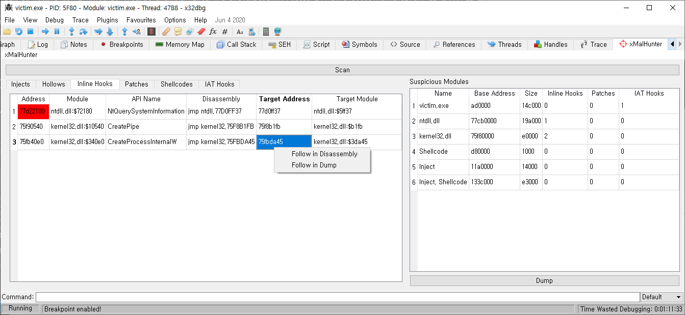

# xMalHunter
[Demo Video](https://www.youtube.com/watch?v=Q8Zj3Rpddnw)

## Features

* Set breakpoint (F2)
* Follow in Disassembler/Dump (Double click)
* Fix IAT and Dump PE

* Find Reflective Injections, Hollows, Shellcodes, Inline/IAT Hooks using pe-sieve

Powered by [pe-sieve](https://github.com/hasherezade/pe-sieve)
